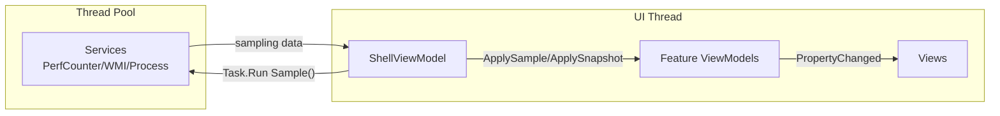

A Windows desktop dashboard for live CPU, memory, disk, and process metrics, built in WPF on .NET 9 using MVVM (Model-View-ViewModel) and Dependency Injection.

## Features

- Overall and per-core CPU utilization for every logical processor
- Used / available / total physical memory with derived percentage
- Disk read and write throughput in MB/s
- 60-second rolling history chart for CPU and memory
- Sortable process list with per-PID CPU% and memory usage
- 1 Hz sampling that never blocks the UI thread

## Architecture

The app is a single window composed of feature views that each bind to their own ViewModel. 
A **ShellViewModel** aggregates the feature ViewModels (Process List, CPU %, Memory %, etc), owns the sampling loop, and is the only DataContext the main window ever sees.

Each one-second tick crosses a thread boundary: sampling runs on the thread pool, results are applied to the bound ViewModels on the UI thread, and XAML data binding takes care of the redraw.

